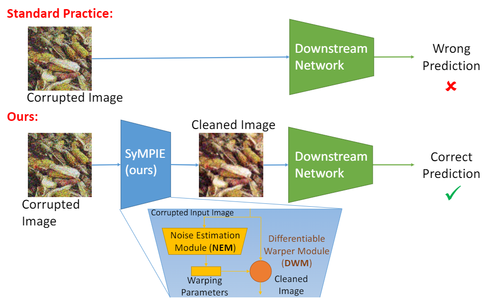
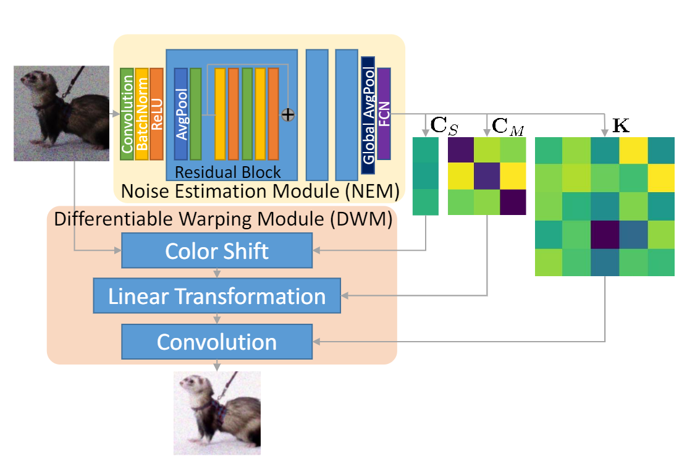

# A Modular System for Enhanced Robustness of Multimedia Understanding Networks via Deep Parametric Estimation, ACM Multimedia Systems 2024.
This repository contains the code to reproduce the results presented in our [paper](https://arxiv.org/abs/2402.18402) and in the [presentation blog](https://research.samsung.com/blog/A-Modular-System-for-Enhanced-Robustness-of-Multimedia-Understanding-Networks-via-Deep-Parametric-Estimation) at the Samsung Research Website. 

Comparison with standard approach | SyMPIE architecture
:--------------------------------:|:-------------------:|
 | 

If you find any of them useful for your research please consider citing us:
```
@article{
  barbato2024modular,
  title={A Modular System for Enhanced Robustness of Multimedia Understanding Networks via Deep Parametric Estimation},
  author={Barbato, Francesco and Michieli, Umberto and Yucel, Mehmet Karim and Zanuttigh, Pietro and Ozay, Mete},
  journal={Proceedings of the ACM conference on Multimedia Systems (MMSys)},
  doi={10.1145/3625468.3647623},
  year={2024}
}
```
Note that due to CUDA-related instabilities the per-corruption numbers you obtain after training may not match those shown in Table 2, but the overall accuracy and improvement will.

## Prerequisites
1. Clone this repository.
2. Create a new python 3.10 environment using conda ([anaconda](https://www.anaconda.com/download), [miniconda](https://docs.anaconda.com/free/miniconda/)): ```conda create -n sympie python==3.10.14```
3. Install the dependencies using pip: ```pip install -r requirements.txt```
4. Download the pretrained checkpoints and place them into ```training/checkpoints```:
    1. [Segmentation pretraining](https://zenodo.org/records/10930713)
    2. [SyMPIE pretrained](https://zenodo.org/records/10930713)
    3. [AugMIX pretrained (optional)](https://zenodo.org/records/10930713)
    4. [PRIME pretrained (optional)](https://zenodo.org/records/10930713)
    5. [PIXMIX pretrained (optional)](https://zenodo.org/records/10930713)
5. To train the architecture download the following datasets (optional):
    1. [ImageNet](https://www.kaggle.com/c/imagenet-object-localization-challenge/overview/description), validation set needs to be formatted in a PyTorch-friendly way:
        1. Download and extract the dataset.
        2. Navigate to ```Data/CLS-LOC```.
        3. Rename the ```val``` folder into ```val_raw```
        4. Create a new empty ```val``` folder.
        4. Copy into the current folder the ```make_clas_val.py``` script provided in the root of this repo.
        5. Run the script.
    2. [Cityscapes](https://www.cityscapes-dataset.com/downloads/)
    3. [ACDC](https://acdc.vision.ee.ethz.ch/download)
5. To validate the architecture download the following datasets:
    1. [ImageNetC](https://github.com/hendrycks/robustness)
    2. [ImageNetC-Bar (optional)](https://github.com/facebookresearch/augmentation-corruption)
    3. [ImageNetC-Mixed (optional)](https://zenodo.org/records/10930713)
    2. [CityScapes (optional)](https://www.cityscapes-dataset.com/downloads/)
    3. [ACDC (optional)](https://acdc.vision.ee.ethz.ch/download)
    4. [DarkZurich (optional)](https://www.trace.ethz.ch/publications/2019/GCMA_UIoU/)
7. Move the text splits provided in ```data``` in the appropriate folder for each dayaset you downloaded.
8. Update the paths listed in the ```config_paths.yaml``` with the ones for your datasets.

## Training
To train our architecture with the default configuration run the following command from ```classification/training```.
```
torchrun --nproc-per-node=8 train.py
```
During training the tensorboard logs are saved in ```classification/training/logs```.

For the evaluation we will assume that, after training, the checkpoint file ```final.pth``` has been copied from your log folder to ```classification/training/checkpoints``` with the name ```sympie_rerun.pth```.

## Evaluation
To run the evaluation navigate to ```classification/eval```.
From there you can start validation with:
```
python validate.py
```
the default configuration uses a ResNet50 classifier with no SyMPIE module enabled. This is needed to compute the baseline against which the deltas generate by ```compare.py``` will be computed.

After completing the baseline evaluation you can get the accuracy for the default SyMPIE checkpoint by:
```
python validate.py --colm sympie
```
this will use the ```classification/training/checkpoints/sympie.pth``` checkpoint.
To use your re-trained checkpoint simply change ```--colm sympie``` to ```--colm sympie_rerun```.

To change the classifier you can set the ```--clas``` argument choosing from the following:
<center>

argument value | classifier used
|:------------:|:---------------|
```rn50_1``` | ResNet50 V1
```rn50_2``` | ResNet50 V2
```yucel``` | ResNet50 Hybridaugment++ (ICCV23)
```rn18``` | ResNet18 V1
```rn34``` | ResNet34 V1
```vgg13bn``` | VGG13 with BN
```vgg13``` | VGG13
```vgg16bn``` | VGG16 with BN
```vgg16``` | VGG16
```mnet_1``` | MobileNetV3-Large V1
```mnet_2``` | MobileNetV2-Large V2
```vitb16``` | ViT-B16
```swint``` | Swin-T
```prime``` | ResNet50 PRIME (ECCV22)
```pixmix``` | ResNet50 PIXMIX (CVPR21)
```clip``` | CLIP

</center>

To validate on ImageNetC-Bar run the script with the ```--bar``` flag.


<p xmlns:cc="http://creativecommons.org/ns#" xmlns:dct="http://purl.org/dc/terms/"><a property="dct:title" rel="cc:attributionURL" href="https://github.com/SamsungLabs/SyMPIE">SyMPIE (A Modular System for Enhanced Robustness of Multimedia Understanding Networks via Deep Parametric Estimation)</a> by <span property="cc:attributionName">Francesco Barbato, Umberto Michieli, Mehmet Yucel, Pietro Zanuttigh, Mete Ozay</span> is licensed under <a href="https://creativecommons.org/licenses/by-nc-sa/4.0/?ref=chooser-v1" target="_blank" rel="license noopener noreferrer" style="display:inline-block;">CC BY-NC-SA 4.0</a></p>
